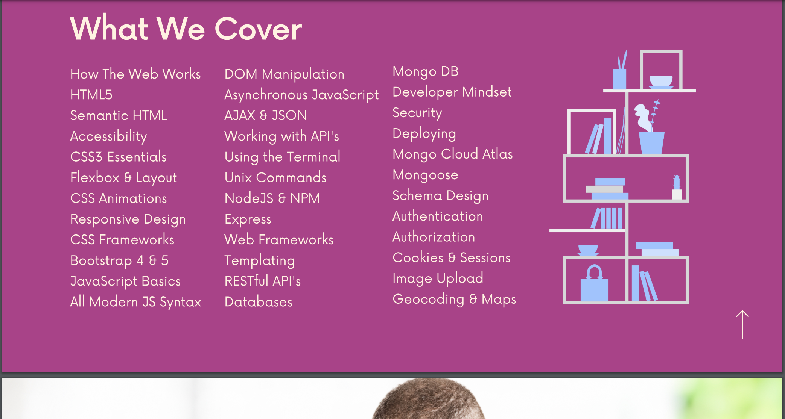

# 1.Welcome To The Course!

> slide pdf: https://www.canva.com/design/DAEJkios3Ok/up1JUl5S_J9Kq5cZZaNFWg/view?utm_content=DAEJkios3Ok&utm_campaign=designshare&utm_medium=link&utm_source=viewer

The goal is to teach you everything you need  to become a developer so  that you can continue to learn and pick up new languages and frameworks as they go in and out of style.

# 2. Joining the community chat and groups

discord:
https://www.coltsteele.com/discord

# 3.Curriculum Walkthrough

# 4.When was the course last updated

# 5.Cource change log

view all changes here:
https://plum-poppy-0ea.notion.site/Web-Developer-Bootcamp-ChangeLog-45e3eab6be724c5f9a4b83c01044e126

# 6.Will i get a job

- do all the exercises
- do not just copy
- take the time
- do not panic
- take breaks

# 7.Accessing course code and slides

# 8.Coding exercises tips

# 9.Course coding exercises Solutions

https://github.com/Colt/TheWebDeveloperBootcampSolutions

---

