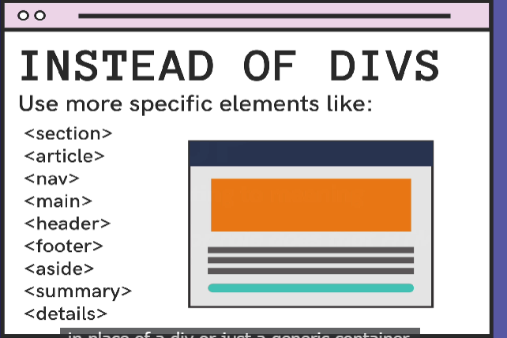

# 32.What matters In this Section

# 33. What actually HTML5 is

HTML5 is the latest version of HTML that introduces new semantic elements, multimedia support, graphics, offline storage, and other features to enhance web development and user experience.

# 34. Block vs. Inline Elements - Divs and Spans

block level: The `
` element is a generic container used to group other elements and apply styles, creating layout structures and sections within a webpage.

inline level: The `` element is an inline container used to group and apply styles to a portion of inline content within a larger block.

# 35.An Odd Assortment of Elements: HR, BR, Sup, & Sub 

\
 horizonal break
\  line break
\ subscript mark
\ superscript mark

# 36. Entity Codes

They start with an ampersand (&) and end with a semicolon (;).
Entities are used to display reserved, special, or difficult-to-type characters in HTML.
https://entitycode.com/#common-content

# 37. Intro to Semantic Markup

meaningful markup, it improves accessibility, maintainability.
Here are some common examples of semantic markup: 

1. `<header>`: Represents the introductory content or a container for navigational links at the top of a page or section. 2. `<nav>`: Represents a section of a page that contains navigation links. 3. `<main>`: Represents the main content of a webpage. 4. `<article>`: Represents a self-contained composition, such as a blog post or news article. 5. `<section>`: Represents a standalone section of a document or a thematic grouping of content. 6. `<aside>`: Represents content that is tangentially related to the main content, such as a sidebar. 7. `<footer>`: Represents the footer content of a page or section. 8. `<h1>` to `<h6>`: Represents different levels of headings. 9. `
`: Represents a paragraph. 10. `<ul>` and `<ol>`: Represents an unordered list and an ordered list, respectively. 

# 38. Playing With Semantic Elements

use more specific elements instead of \
:

# 39. Screen Reader Demonstration

-

# 40. VSCode Tip: Emmet.

https://docs.emmet.io/cheat-sheet/

