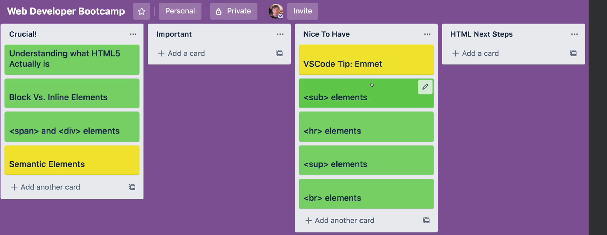

# 32.What matters In this Section



# 33. What actually HTML5 is

HTML is a language or syntax that we use to mark up documents, webpages.

To write HTML, we pick from a set of standard elements that all browsers recognize

- \<p>element - represents a paragraph of text
- \<h1>element - represents the main header on a page
- \ element - embeds an image
- \<form> element - represents a from

We create elements by writing tags. most tags consist of an opening and closing tag.

# 21. Our Very First HTML Page

Create a `chinken.html` in vscode.

# 22. TIP: Mozilla Developer Network

useful resources:
https://developer.mozilla.org/en-US/docs/Web/HTML/Element
https://developer.mozilla.org/en-US/


# 23.Paragraph Elements

\<p>\</p>


# 24.Heading Elements

```html
<h1>1Beetles</h1>
<h2>2External morp</h2>
<h3>3Head</h3>
<h4>4Mouthparts</h4>
<h3>3Thorax</h3>
<h4>4Prothorax</h4>
<h4>4Pterothorax</h4>
<h5>5Pter rax</h5>
<h6>6Pte </h6>
```


https://developer.mozilla.org/en-US/docs/Web/HTML/Element/Heading_Elements#try_it

# 25. Introduction to the Chrome Inspector

chrome inspector shortcut: F12 / ctrl+shift+I
select an element in the page to inspect: ctrl+shift+c 

# 26. HTML Boilerplate

html skeleton:

```htm
<!DOCTYPE html>
<html lang="en">
<head>
    <meta charset="UTF-8">
    <meta name="viewport" content="width=device-width, initial-scale=1.0">
    <title>Document</title>
</head>
<body>

</body>
</html>

```

1. `<!DOCTYPE html>`: 声明文档类型，告诉浏览器使用 HTML5 标准进行解析。
2. `<html lang="en">`: 开始 HTML 文档，并指定文档的语言（此处为英语）。
3. \<head>: 包含元数据（meta-information），如文档的字符集、标题、样式表链接等。
   - `<meta charset="UTF-8">`: 指定字符编码为 UTF-8，这是一种通用的字符编码，可以表示几乎所有的字符。
   - `<meta name="viewport" content="width=device-width, initial-scale=1.0">`: 设置视口（viewport）的元数据，以确保页面在不同设备上的良好显示。
   - `<title>Document</title>`: 指定网页的标题，这将显示在浏览器标签上。
4. `<body>`: 包含网页的内容，是用户在浏览器中看到的部分。

这是一个最小的 HTML 文件结构，它可以根据具体需求进行扩展和修改。例如，可以在 `<head>` 中添加链接到 CSS 样式表，或在 `<body>` 中添加各种 HTML 元素，如标题、段落、图像、链接等。

`!+Tab` in vscode will create a html template.

# 27.Autofitting in Vscode

setting->format->save on formatting

command+shift+p -> formate document

# 28.List Elements

\<ul> unordered list
\<ol> order list 
\<li> list item

# 29.AnchorTags

\<a> url
\<a href="about.html">ABOUT PAGE</a>

# 30.Images

\

# 31.Comments

<!--    -->
